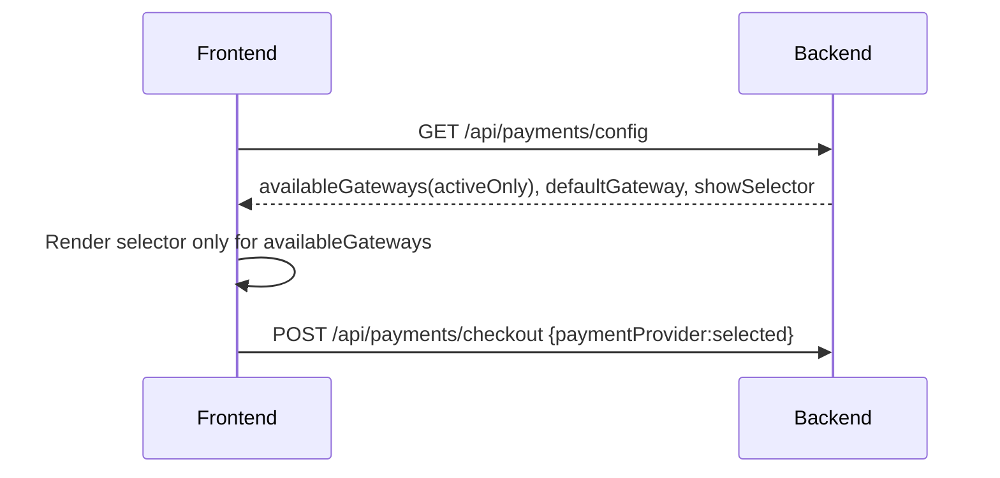

# Show only active payment methods + add Tamara

## Goal

- **UI must only show active payment methods**.
- “Active” is defined by backend config **`PaymentGateway:EnabledGateways`** and **credential validation** (hide provider if required keys are missing/placeholder).

## Backend (ASP.NET Core)

- **Replace the legacy `GatewayMethod` switch with an explicit allow-list**:
  - Add `PaymentGateway:EnabledGateways: ["ClickPay","HyperPay","Tamara"]` (order matters).
  - Update [`backend/src/Services/PaymentService.cs`](backend/src/Services/PaymentService.cs):
    - `GetAvailableGateways()` should:
      - start from `EnabledGateways`
      - filter to gateways actually registered in DI (`_gateways`)
      - filter out gateways whose required config is missing (credential gating)
    - `GetDefaultGateway()` should:
      - prefer `PaymentGateway:DefaultGateway` **only if it’s available**
      - otherwise fall back to the first available gateway.
- **Make `/api/payments/config` authoritative for UI**:
  - Keep [`backend/src/Controllers/PaymentsController.cs`](backend/src/Controllers/PaymentsController.cs) returning:
    - `AvailableGateways` = active gateways
    - `DefaultGateway` = active default
    - `ShowSelector` = `AvailableGateways.Count > 1`
  - Treat `GatewayMethod` as **legacy** (keep for backward compatibility but do not rely on it in UI).
- **Credential gating rules (backend)**
  - Implement small provider-specific checks:
    - ClickPay: `ProfileId` + `ServerKey` non-empty and not `your-*`
    - HyperPay: `EntityId` + `AccessToken` non-empty and not `your-*`
    - Tamara: `ApiBaseUrl` + `ApiToken` + `NotificationToken` non-empty and not `your-*`

## Add Tamara (Direct API)

- **Gateway implementation**:
  - Create [`backend/src/Services/TamaraGateway.cs`](backend/src/Services/TamaraGateway.cs) implementing `IPaymentGateway`.
  - `InitiatePaymentAsync`: call Tamara Direct API (sandbox/prod base URL from config) and return a redirect/checkout URL + provider reference.
  - `ProcessWebhookAsync`: verify webhook using Tamara notification token/signature rules from `docs.tamara.co`, update `Payment` + `Order` statuses.
  - `RefundAsync`: map to Tamara refund/cancel API if supported.
- **Wire it up**:
  - Register in [`backend/src/Program.cs`](backend/src/Program.cs):
    - `AddScoped<IPaymentGateway, TamaraGateway>()`
  - Add provider webhook endpoint in [`backend/src/Controllers/PaymentsController.cs`](backend/src/Controllers/PaymentsController.cs):
    - `POST /api/payments/tamara/webhook`
  - Extend [`backend/src/Services/PaymentService.cs`](backend/src/Services/PaymentService.cs) webhook post-processing to extract `orderId` for provider `Tamara`.

## Frontend (Next.js)

- **Always render payment methods from backend config**:
  - Add a small `PaymentMethodSelector` (presentation-only) that receives `availableGateways/defaultGateway`.
  - Update `[frontend/app/[locale]/checkout/page.tsx](frontend/app/[locale]/checkout/page.tsx)` to:
    - call `paymentsApi.getConfig()` on load
    - show selector only when `showSelector` is true
    - pass chosen provider into `paymentsApi.createCheckout({ orderId, returnUrl, paymentProvider })`
  - Result: UI will **only show gateways the backend considers active**.
