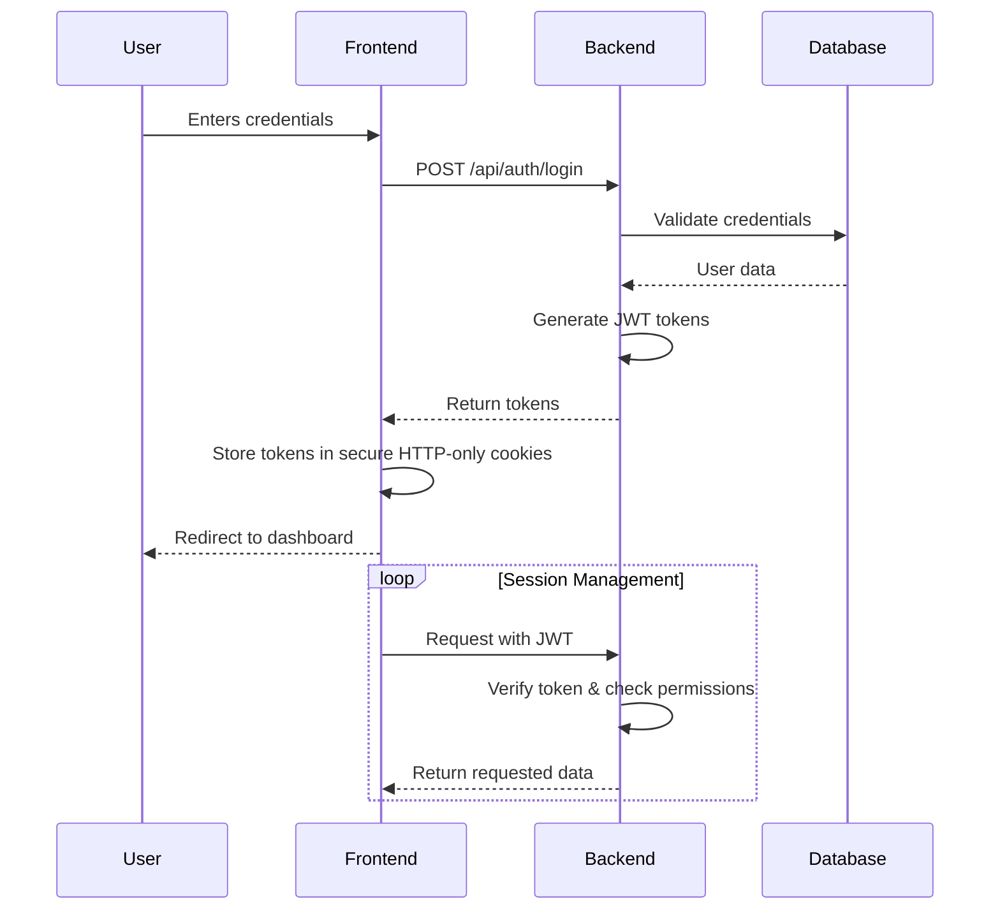
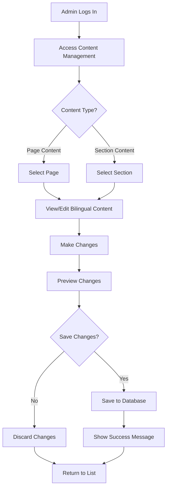
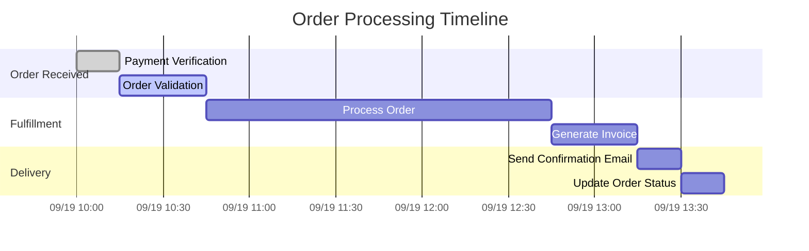
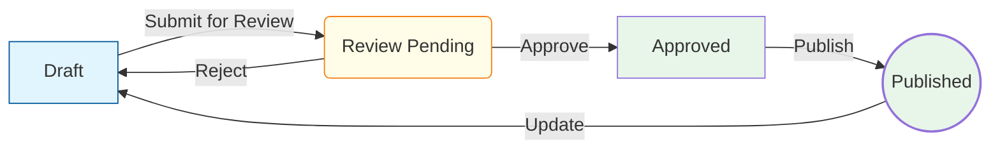
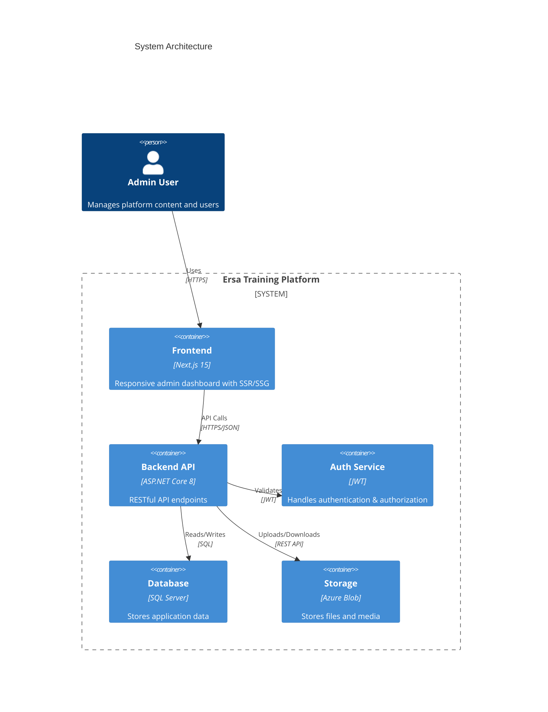

# Workflow Diagrams

This document contains visual representations of key workflows in the Ersa Training Admin Dashboard.

## Authentication Flow



## Content Management Workflow



## User Management Workflow

```mermaid
stateDiagram-v2
    [*] --> UserList
    
    state UserList {
        [*] --> ViewUsers
        ViewUsers --> AddUser
        ViewUsers --> EditUser
        ViewUsers --> ViewUserDetails
    }
    
    state AddUser {
        [*] --> FillUserForm
        FillUserForm --> SubmitForm
        SubmitForm --> ValidateData
        ValidateData -->|Success| SaveUser
        ValidateData -->|Error| ShowErrors
        SaveUser --> UserList
        ShowErrors --> FillUserForm
    }
    
    state EditUser {
        [*] --> LoadUserData
        LoadUserData --> UpdateForm
        UpdateForm --> SubmitUpdate
        SubmitUpdate --> ValidateUpdate
        ValidateUpdate -->|Success| SaveChanges
        ValidateUpdate -->|Error| ShowUpdateErrors
        SaveChanges --> UserList
        ShowUpdateErrors --> UpdateForm
    }
    
    state ViewUserDetails {
        [*] --> ShowUserInfo
        ShowUserInfo --> EditUser
        ShowUserInfo --> BackToList
        BackToList --> UserList
    }
```

## Order Processing Workflow



## Content Publishing Workflow



## System Architecture



## How to Use These Diagrams

1. **Mermaid Support**: These diagrams use Mermaid.js syntax which is supported by most modern markdown viewers including GitHub, GitLab, and VS Code with the Mermaid extension.

2. **Editing**: To modify a diagram, edit the Mermaid code between the ```mermaid code fences.

3. **Exporting**: To export as an image:
   - In VS Code: Use the Mermaid extension to export as PNG/SVG
   - Online: Use the [Mermaid Live Editor](https://mermaid.live/)

4. **Adding New Diagrams**:
   - Follow the existing patterns
   - Keep diagrams focused on a single workflow
   - Include a title and brief description
   - Use consistent styling and colors
